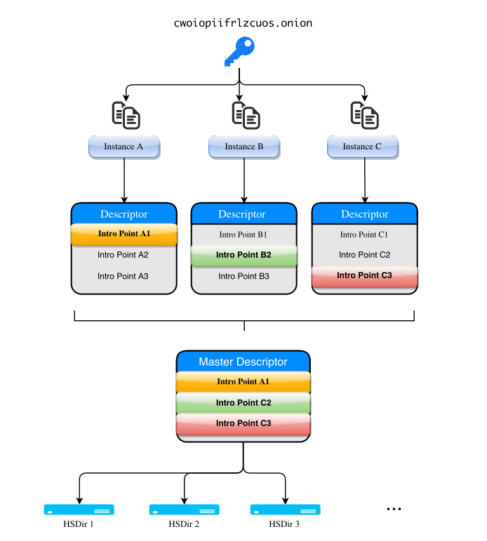

.. _getting_started:

Getting Started
===============

OnionBalance implements `round-robin` like load balancing on top of Tor
onion services. A typical OnionBalance deployment will incorporate one management
servers and multiple backend application servers.

Architecture
------------

The management server runs the OnionBalance daemon. OnionBalance combines the routing information (the introduction points) for multiple backend onion services instances and publishes this information in a master descriptor..

The backend application servers run a standard Tor onion service. When a client connects to the public onion service they select one of the introduction points at random. When the introduction circuit completes the user is connected to the corresponding backend instance.

**Management Server**
  is the machine running the OnionBalance daemon. It needs to have access to the onion
  service private key corresponding for the desired onion address. This is the public onion address that users will request.

  This machine can be located geographically isolated from the machines
  hosting the onion service content. It does not need to serve any content.

**Backend Instance**
  Each backend application server runs a Tor onion service with a unique onion service key.

.. note::
    The :ref:`onionbalance-config <onionbalance_config>` tool can be used to
    quickly generate keys and config files for your OnionBalance deployment.

The OnionBalance tool provide two command line tools:

 **onionbalance** acts as a long running daemon.

 **onionbalance-config** is a helper utility which eases the process of
 creating keys and configuration files for onionbalance and the backend
 Tor instances.

CLI Documentation
~~~~~~~~~~~~~~~~~

 .. toctree::
   :maxdepth: 1

   onionbalance <running-onionbalance>
   onionbalance-config  <onionbalance-config>

Installing and Configuring Tor
------------------------------

Tor is need on the management server and every backend onion service
instance.

Management Server
~~~~~~~~~~~~~~~~~

OnionBalance requires that a recent version of Tor (``>= 0.2.7.1-alpha``) is
installed on the management server system. This version might not be available
in your operating system's repositories yet.

It is recommended that you install Tor from the
`Tor Project repositories <https://www.torproject.org/download/download-unix.html.en>`_
to ensure you stay up to date with the latest Tor releases.

The management server need to have its control port enabled to allow
the OnionBalance daemon to talk to the Tor process. This can be done by
uncommenting the ``ControlPort`` option in your ``torrc`` configuration file.

Alternatively you can replace your ``torrc`` file with the following
is suitable for the Tor instance running on the management server:

.. literalinclude:: ../onionbalance/data/torrc-server
   :name: torrc-server
   :lines: 6-

After configuring Tor you should restart your Tor process

.. code-block:: console

    $ sudo service tor reload

Backend Instances
~~~~~~~~~~~~~~~~~

Each backend instance should be run a standard onion service which serves your
website or other content. More information about configuring onion services is
available in the Tor Project's
`hidden service configuration guide <https://www.torproject.org/docs/tor-hidden-service.html.en>`_.

If you have used the ``onionbalance-config`` tool you should transfer the
generated instance config files and keys to the Tor configuration directory
on the backend servers.

.. literalinclude:: ../onionbalance/data/torrc-instance
   :name: torrc-instance
   :lines: 6-

After configuring Tor you should restart your Tor process

.. code-block:: console

    $ sudo service tor reload
